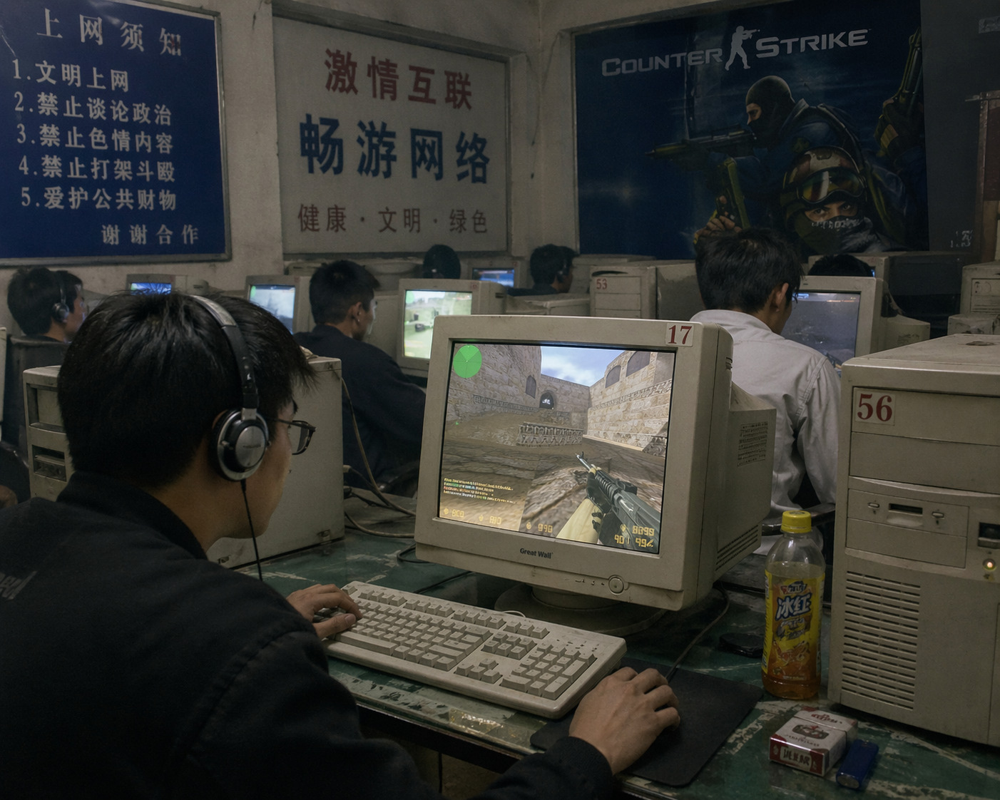

# pyultrahdr

**Turn any ordinary SDR image into a real Ultra HDR JPEG — in pure Python, no `libultrahdr` required.**

| Before — plain SDR | After — Ultra HDR JPEG |
|---|---|
|  |  |

> **Open this README in Chrome on an HDR display** (Windows 11 24H2 / macOS Sonoma / Android 14+ / iOS 17.4+) to see the right image light up. On an SDR display the two look identical — that's the point: Ultra HDR degrades gracefully everywhere and pops wherever HDR is available.

The output is a standard JPEG on the surface, but on an HDR display the highlights punch up to ~1000 nits. On SDR displays it looks like a perfectly normal photo. One file, two worlds.

```
python sdr_to_hdr.py your_photo.jpg
# → your_photo_ultrahdr.jpg
```

Open that file in Chrome on an HDR monitor. The sun will actually be bright.

## Why this exists

Google's [Ultra HDR format](https://developer.android.com/media/platform/hdr-image-format) (also standardised as **ISO 21496-1**) is the easiest way to ship HDR photos on the web today — it's just a regular JPEG plus an embedded gain map, so it degrades gracefully everywhere. But the only production-quality tooling is Google's C++ [`libultrahdr`](https://github.com/google/libultrahdr), which is painful to build, wrap, and deploy — especially on Windows.

`pyultrahdr` is a ~230-line Python script that produces **byte-compatible Ultra HDR JPEGs** from any SDR input. Zero C dependencies, zero build system, just `numpy` and `Pillow`. Drop it into a pipeline, a Jupyter notebook, or a batch job.

## Features

- **Pure Python.** `numpy` + `Pillow`. Works on Windows/macOS/Linux out of the box.
- **Byte-compatible MPF/XMP.** The Multi-Picture Format APP2 segment and `hdrgm:` XMP metadata are structured to match Google's reference samples — verified by hex-diffing against real Ultra HDR files from the wild.
- **Monotonic inverse tone mapping.** Every pixel gets a visible boost; no knee-curve artefacts that leave mid-tones looking flat.
- **BT.709 → BT.2020** gamut expansion in linear light.
- **Configurable peak brightness** (default 1000 nits) and **SDR reference white** (default 203 nits, per BT.2408).
- **Single-file script** — copy, paste, ship.

## Install

```bash
pip install numpy pillow
```

Then grab the script:

```bash
curl -O https://raw.githubusercontent.com/hanfeisun/pyultrahdr/main/sdr_to_hdr.py
```

## Usage

```bash
python sdr_to_hdr.py input.png
```

Flags:

| Flag | Default | What it does |
|---|---|---|
| `--peak-nits` | `1000` | Target HDR peak brightness |
| `--sdr-white` | `203` | SDR reference white in nits (BT.2408) |
| `--quality` | `92` | Base JPEG quality (1-100) |
| `--gainmap-quality` | `85` | Gain map JPEG quality (1-100) |

Batch convert a folder:

```python
from pathlib import Path
import subprocess, sys

for p in Path('photos').glob('*.jpg'):
    subprocess.run([sys.executable, 'sdr_to_hdr.py', str(p)])
```

## How to view the result

- **Chrome 116+** on an HDR-capable display (Windows 11 24H2, macOS Sonoma+, ChromeOS). Make sure HDR is toggled on in your OS display settings.
- **Android 14+** Gallery / Google Photos.
- **iOS 17.4+** Photos.
- **Windows 11 Photos app** (24H2 and later).

You can test your own HDR chain with samples from [gregbenzphotography.com/hdr-demo](https://gregbenzphotography.com/hdr-demo/) or the [MishaalRahmanGH/Ultra_HDR_Samples](https://github.com/MishaalRahmanGH/Ultra_HDR_Samples) repo.

## How it works

```
 SDR sRGB 8-bit
      │
      ▼  sRGB EOTF
 linear [0,1]
      │
      ▼  inverse tone mapping:  boost(L) = s + (p - s) · L^γ
 HDR in nits
      │
      ▼  BT.709 → BT.2020 matrix
 HDR BT.2020 (nits)
      │
      ▼  per-pixel log2(HDR / SDR)  → gain map
 gain map (grayscale, 8-bit)
      │
      ▼  assemble:  SOI + XMP(hdrgm:) + MPF(APP2) + baseJPEG + gainmapJPEG
 Ultra HDR JPEG
```

The resulting file has:

1. A normal baseline JPEG (your SDR image, re-encoded).
2. An XMP APP1 block with Adobe's `hdrgm:1.0` namespace describing the gain map parameters (`GainMapMin`, `GainMapMax`, `HDRCapacityMin`, `HDRCapacityMax`, `OffsetSDR`, `OffsetHDR`).
3. An MPF APP2 block (CIPA DC-007 Multi-Picture Format) pointing from the primary image to the secondary (gain map) image.
4. The gain map itself as a second JPEG concatenated to the end.

An HDR-aware decoder reads the gain map, applies it per-pixel (in log2-linear space) to reconstruct HDR radiance, and sends PQ/HDR10 signal to the display. An SDR decoder just sees the first JPEG and ignores the rest.

## Why not just a PQ PNG / AVIF / JXL?

- **PNG/AVIF/JXL with PQ** works, but only the handful of apps that understand HDR containers will render correctly. Everywhere else the image looks washed out.
- **Ultra HDR** degrades gracefully to a normal SDR JPEG everywhere, and lights up on HDR-capable platforms. That's why the web is converging on it.

## Limitations

- The inverse tone mapping is heuristic. It looks great on natural photos and screenshots, but it's not a learned model — don't expect it to recover clipped highlights that were never captured. If you need a learned ITM, look at [ExpandNet](https://github.com/dmarnerides/hdr-expandnet), [HDRCNN](https://github.com/gabrieleilertsen/hdrcnn), or [SingleHDR](https://github.com/alex04072000/SingleHDR) and feed their output into this script's assembly stage.
- The gain map is single-channel (luminance). RGB gain maps are allowed by the spec but rare in the wild.

## License

MIT. See [LICENSE](LICENSE).

## References

- Google, [Ultra HDR Image Format v1.0](https://developer.android.com/media/platform/hdr-image-format)
- ISO/IEC 21496-1 — Gain map metadata for image conversion
- Adobe, [Gain Map Specification (`hdrgm:`)](https://helpx.adobe.com/camera-raw/using/gain-map.html)
- CIPA DC-007 — Multi-Picture Format
- ITU-R BT.2408 — SDR reference white at 203 nits
- Banterle et al., *Advanced High Dynamic Range Imaging* (inverse tone mapping background)

---

If this saved you a day of wrestling with C++ toolchains, star the repo. PRs welcome.
